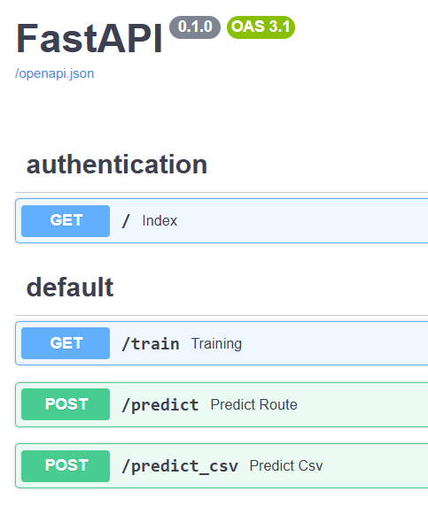

# Loan-Default-Prediction

This dataset has been taken from https://www.kaggle.com/datasets/yasserh/loan-default-dataset

# Full End-to-End CI/CD Summary for ML Model Deployment (Docker + GitHub Actions + AWS EC2)
## Step 1: Build and test the ML model locally. Tool: VS Code.
## Step 2: Dockerize the app and run container locally. Tool: Docker
- Open terminal in the project and run:
    - docker build -t loan_default_prediction:latest .
- Verify the image was built. In the terminal, run:
    -  docker images
- Run the container locally:
    - docker run -p 8000:8000 loan_default_prediction:latest
- Test the app at http://localhost:8080 to ensure it's working in the container.

## Step 3: Create IAM user for deployment in AWS
Go to AWS → IAM → Users → Create User
- Attach the following policies:
    - AmazonEC2ContainerRegistryFullAccess
    - AmazonEC2FullAccess

- Create access keys (CSV) and download it — contains:
    - AWS_ACCESS_KEY_ID
    - AWS_SECRET_ACCESS_KEY

## Step 4: Create ECR repository in AWS
- Go to AWS → ECR → Create Repository (e.g., loan-default-predictor)
- Save the ECR URL

## Step 5: Launch EC2 instance
- Choose Ubuntu, t2.micro or larger
- Create and download a key pair (.pem file)
- Enable inbound rules for ports:
    - 22 (SSH)
    - 80 (HTTP)
    - 443 (HTTPS)
    - 8080 (Custom TCP)
- Add port mapping in EC2 Security Group
In AWS → EC2 → Security Groups → Edit Inbound Rules
Add rule:
    - Type: Custom TCP
    - Port: 8080
    - Source: 0.0.0.0/0 (or restrict to your IP)
    - Launch the instance

## Step 6: Install Docker on the EC2 instance (only need to install Docker once for one instance)

#optinal
- sudo apt-get update -y
- sudo apt-get upgrade

#required
- curl -fsSL https://get.docker.com -o get-docker.sh
- sudo sh get-docker.sh
- sudo usermod -aG docker ubuntu
- newgrp docker
- docker --version

## Step 7: Configure EC2 as a self-hosted GitHub runner
In GitHub:
- Settings → Actions → Runners → New self-hosted runner

Follow instructions to:
- Download and install the runner on EC2
- Run ./config.sh and ./run.sh
- It will show as idle in GitHub runners list

## Step 8: Add GitHub secrets for AWS + ECR
- In GitHub → Settings → Secrets and Variables → Actions, add:
    - AWS_ACCESS_KEY_ID
    - AWS_SECRET_ACCESS_KEY
    - AWS_REGION
    - AWS_ECR_LOGIN_URI → just the domain part
    - ECR_REPOSITORY_NAME 
## Step 9: Create GitHub Actions workflow (main.yaml)
In .github/workflows/main.yaml, define:
- CI: Lint, test your code
- Build Docker image on GitHub-hosted runner
- Push to Amazon ECR
- CD: Pull image on EC2, stop old container, run new one

## Step 10: Commit and push code to GitHub
- This triggers GitHub Actions
- CI/CD pipeline runs automatically

## Step 11: Test the deployed website
Go to EC2 Public IPv4 Address:
http://<your-ec2-ip>:8080
The model API or frontend should be live!

You can see something as follows:

## Step 12: Tear down resources (optional)

To clean up:
- Terminate the EC2 instance
- Delete the ECR repository
- Delete the IAM user

## Uvicorn
- It is a Python ASGI web server.
- Its responsibilities:
    - Listen for HTTP/WebSocket requests.
    - Package each request into the three ASGI parameters:
        - scope: request metadata (path, HTTP method, etc.)
        - receive: an async function to receive client messages
        - send: an async function to send responses back
    - Call an ASGI callable (e.g., a FastAPI instance app = FastAPI()).

## FastAPI Application Instance
- Acts as an ASGI callable.
- Receives the (scope, receive, send) parameters from Uvicorn.
- Processing steps:
    - Match the route based on scope
    - Call the corresponding route handler (e.g., predition())
    - Get the result
    - Return the result via send to Uvicorn

## Response back to the client
- Uvicorn sends the response received from send back to the browser or client.

# Simplified Flow Diagram

- Browser request
  - ↓
- Uvicorn (ASGI server)
  - ↓ Packages request as scope, receive, send
- FastAPI app (ASGI callable)
  - ↓ Matches route and calls handler
- Route handler (prediction function)
  - ↓ Returns result to FastAPI app
  - ↓ Sent via send to Uvicorn
- Browser receives response

